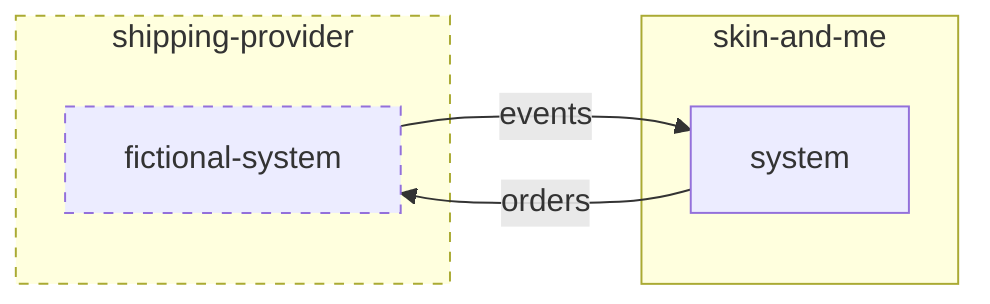

# Skin + Me - Tech Assessment - Backend (Factory)

## The Task
We would like you to build a small Python web application (preferably using the Flask framework and SQLAlchemy) that integrates to a fictional shipping provider (think about Royal Mail or DHL), and send them customer orders to deliver on a periodic basis.

1.  Provide an interface to send customer orders to a fictional shipping provider (in the design, keep in mind in the future we could have multiple providers)
2.  Provide an interface that will allow the shipping provider to communicate events back to our system. Such events could be:
    1.  waiting for collection
    2.  in transit
    3.  delivered
    4.  failed to deliver
3.  Produce a mechanism to ship customer orders periodically based on their scheduled shipping interval
    1.  weekly
    2.  montly



#### Sending orders to the fictional shipping provider

The fictional provider would expect to receive a `POST` request in a JSON format containing the following data:

| field | value | description |
| --- | --- | --- |
| `order_id` | `str(35)` | Unique identifier for the order |
| `delivery_service` | `str` | The expected delivery service, this can either be `standard` or `express` |
| `items` | `list[dict]` | A list of items to deliver, and their quantity (see `items` schema defined below) |
| `delivery_address` | `dict` | The delivery address (see `delivery_address` schema defined below) |

`items` schema
| field | value | description |
| --- | --- | --- |
| `item_id` | `str(35)` | Unique identifier for the item |
| `quantity` | `int` | Quantity of items |
| `weight` | `int` | Weight |

`delivery_address` schema
| field | value | description |
| --- | --- | --- |
| `recipient` | `str(35)` | Name of the recipient |
| `line_1` | `str(35)` | Address line 1 |
| `line_2` | `str(35)` | Address line 2 |
| `city` | `str(35)` | City |
| `postcode` | `str(35)` | Postcode |
| `country` | `str(2)` | Country code (`GB`) |

Example:
```json
{
    "order_id": "co-1",
    "delivery_service": "standard",
    "items": [{
        "item_id": "it-1",
        "quantity": 2,
        "weight": 10,
    }],
    "delivery_address": {
        "recipient": "John Doe",
        "line_1": "The battleship building",
        "line_2": "179 harrow road",
        "city": "London",
        "postcode": "W2 6NB",
        "country": "GB",
    }
}
```

#### Receiving events from the fictional shipping provider

Events coming from the fictional provider would be communicated to our system via webhook `POST` requests in a JSON format:

| field | value | description |
| --- | --- | --- |
| `order_id` | `str(35)` | Unique identifier for the order |
| `event_name` | `str` | The event name: `waiting-for-collection`, `in-transit`, `delivered`, `failed-to-deliver` |
| `event_time` | `datetime` | Time of when the event occurred |

Example:
```json
{
    "order_id": "co-1",
    "event_name": "in-transit",
    "event_time": "2023-05-19 13:18:45",
}
```

This request would expect our system to reply with a 200 response to validate it received it correctly.

### Tips
1.  Feel free to seed your database with static customer orders, we don't expect you to build an interface to create orders.
2.  We don't expect you to integrate to a real shipping provider. Just use a fictional endpoint where you could send orders to.
3.  This is obviously a broad task, we don't expect you to create something that is fully functional.
4.  By giving you a lot of freedom we want you to be able to demonstrate your skills in terms of how to structure a codebase.

## Further Guidance
So you know what we are looking for, the following is a list of themes we will use to assess your work.

- Knowledge and understanding of Python, Relational Databases and general backend development.
- Data models definition.
- Understanding of architecture and system design.
- Clean code and use of standards.
- Awareness of testing and testability.
- Consideration given to productionisation.
- Comments in your code for anything you want to convey your thought process or what you might do given more time.
- README on how to start your project, plus any other information you feel is relevant.
- We would like you to create a private repository in your github account and commit your code to it. We would urge you to commit relatively frequently so we can get an idea of your style and approach.
