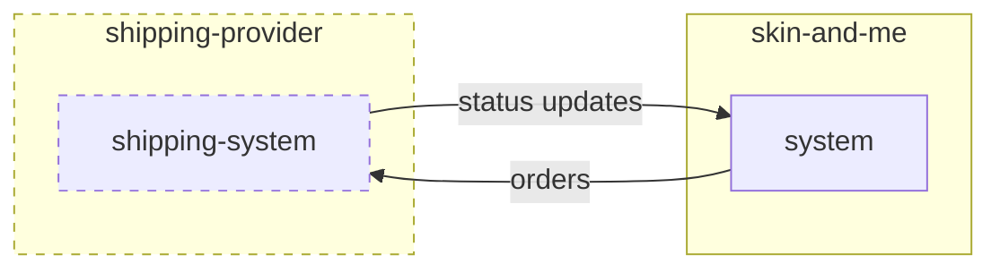

# Skin + Me - Tech Assessment - Backend (Factory)

## The Task
We would like you to build a small Python web application, preferably using the Flask framework and SQLAlchemy. The application should allow Skin + Me to periodically ship customer orders via a shipping provider such as Royal Mail or DHL. There are three parts to this task.

1.  Provide an API endpoint to submit a Skin + Me customer order to the shipping provider, utilising the shipping provider’s API. Keep in mind in the future we could have multiple providers
2.  Provide an API endpoint that will allow the shipping provider to communicate status updates relating to the customer order back to our system. Such statuses could be:
    1.  waiting for collection
    2.  in transit
    3.  delivered
    4.  failed to deliver
3.  Produce a mechanism to ship customer orders periodically based on their scheduled shipping interval
    1.  weekly
    2.  monthly



### Submitting customer orders to the shipping provider

The shipping provider expects to receive a `POST` request with a JSON body containing the following data:

| field | value | description |
| --- | --- | --- |
| `delivery_service` | `str` | The expected delivery service, this can either be `standard` or `express` |
| `items` | `list[Item]` | A list of items contained within the order being shipped (see `Item` schema defined below) |
| `delivery_address` | `DeliveryAddress` | The delivery address (see `DeliveryAddress` schema defined below) |
| `weight` | `int` | The total weight of the items being shipped in this shipment |

`Item` schema
| field | value | description |
| --- | --- | --- |
| `description` | `str` | The item's description |
| `quantity` | `int` | Quantity of the item |

`DeliveryAddress` schema
| field | value | description |
| --- | --- | --- |
| `recipient` | `str` | Name of the recipient |
| `line_1` | `str` | Address line 1 |
| `line_2` | `str` | Address line 2 |
| `city` | `str` | City |
| `postcode` | `str` | Postcode |
| `country` | `str` | Two digit country code (`GB`) |

Example
```json
{
    "delivery_service": "standard",
    "items": [
        {
            "description": "Moisturiser, 50ml",
            "quantity": 2
        },
        {
            "description": "Cleanser, 100ml",
            "quantity": 1
        }
    ],
    "delivery_address": {
        "recipient": "John Doe",
        "line_1": "The battleship building",
        "line_2": "179 harrow road",
        "city": "London",
        "postcode": "W2 6NB",
        "country": "GB"
    },
    "weight": 300
}
```

Upon a successful response, the shipping provider will return a 200 with a JSON body containing the following data:

| field | value | description |
| --- | --- | --- |
| `shipment_id` | `str` | The shipping provider's unique identifier for the shipment created for the order. This will be returned in any communication from the shipping provider relating to this shipment |
| `status` | `str` | The shipment’s status: `waiting-for-collection`, `in-transit`, `delivered`, `failed-to-deliver` |

Example
```json
{
    "shipment_id": "SHI-123ABC",
    "status": "waiting-for-collection"
}
```

### Receiving status updates from the shipping provider

Status updates from the shipping provider would be communicated to our system via `POST` requests in a JSON format:

| field | value | description |
| --- | --- | --- |
| `shipment_id` | `str` | The shipping provider's unique identifier for the shipment |
| `status` | `str` | The shipment’s new status: `waiting-for-collection`, `in-transit`, `delivered`, `failed-to-deliver` |
| `event_time` | `datetime` | When the event occurred |

Example:
```json
{
    "shipment_id": "SHI-123ABC",
    "status": "in-transit",
    "event_time": "2023-05-19 13:18:45",
}
```

The shipping provider expects our system to reply with a 200 response to indicate the request was successful.

## Skeleton code

Provided is a skeleton application to help you get going faster. Feel free to use it, or start from scratch if you prefer.

Start the application and a MySQL database:
```
make start
```

It should have created two containers (`backend-assessment-factory-app-1` and `backend-assessment-factory-db-1`).
You should now be able to curl: http://0.0.0.0:5000/api/health and receive a 200 response saying: "This system is alive!"

Stop the application and the MySQL database:
```
make stop
```

Credentials and secrets can be found under `./environments/dev.txt`

### Testing

Create a virtual environment and install dependencies with
```
make venv deps
```

Then you can run the tests using
```
make tests
```

## Further Guidance

So you know what we are looking for, the following is a list of themes we will use to assess your work.


- Use of patterns where appropriate
- Sensible relational database structure
- Understanding of architecture and system design
- Understanding of SOLID principles
- Clean code and use of standards
- Awareness of testing and testability
- Consideration given to productionisation
- Comments in your code for anything you want to convey your thought process or what you might do given more time
- README on how to start your project, plus any other information you feel is relevant
- We would like you to create a private repository in your github account and commit your code to it. We would urge you to commit relatively frequently so we can get an idea of your style and approach
